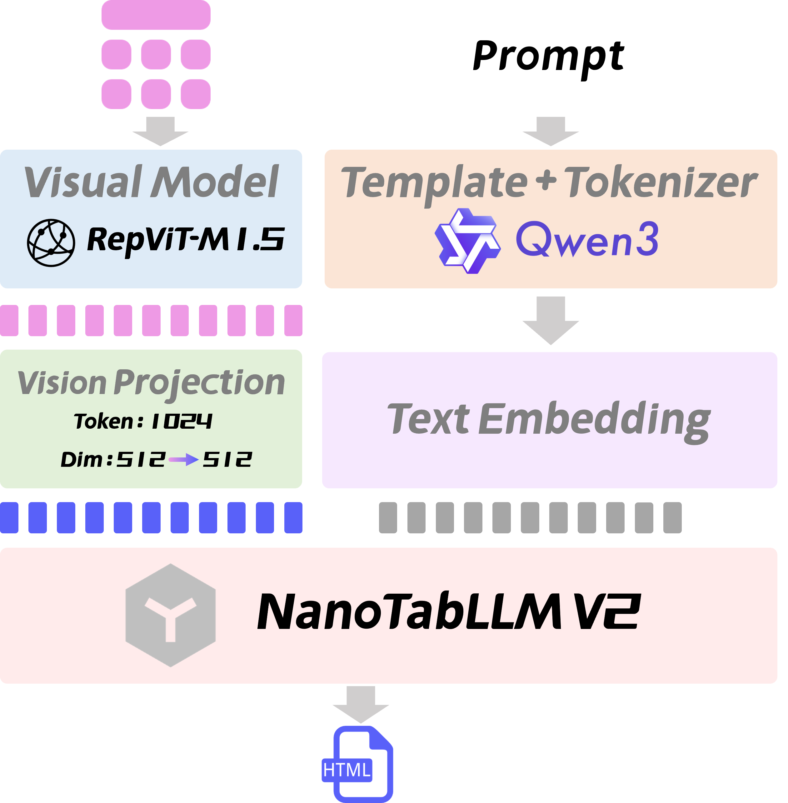

<div align="center">
  
</div>

# NanoTabVLM: Small Model, Great Achievements


[中文](./README.md) | English


## Introduction
NanoTabVLM is a lightweight multimodal model with only 0.25 billion parameters, yet it boasts powerful table processing capabilities. It focuses on accurately converting tables in images into HTML-format text and delivers outstanding performance in conversion accuracy. Its average Edit Distance is less than 1/7 of that of 8B-parameter models, and even only 1/10 of that of VLM models with the same parameter scale. Moreover, it can flexibly handle various complex table styles such as cross-row, cross-column, and tables containing blank spaces. In the field of multimodal/visual multimodal understanding, it plays an efficient role and provides a convenient and accurate solution for the digital conversion of tables.  
As an upgraded and iterative version of this series, NanoTabVLM V2 has further broken the boundary between "lightweight" and "high performance" — it has only **0.08B parameters (80M parameters)**, which is merely 30% of the parameter count of the V1 version. However, it has achieved performance surpassing the V1 version in the core task of converting image tables to HTML. Under the same test benchmark, the average Edit Distance of NanoTabVLM V2 is only 1/2 of that of the V1 version. It not only significantly outperforms the original NanoTabVLM but also demonstrates an overwhelming advantage over traditional VLM models with parameter counts dozens of times (such as 2B and 4B-parameter models) or even hundreds of times (such as 8B and 9B-parameter models) that of itself. Even when dealing with complex table scenarios like cross-row, cross-column, and tables with empty cells, it can still maintain extremely high conversion accuracy. It provides a better table digitalization solution for scenarios with more stringent requirements on deployment resources and pursuit of ultimate efficiency (such as edge devices and lightweight office tools).


Comparative experiments with several other models fully demonstrate the excellent performance of NanoTabVLM. The specific results are as follows (Table<sup>Edit</sup>↓) :

| 模型                   | Size                   | all                     | zh                      | en                      | span                    | blank                   |
|----------------------|------------------------|-------------------------|-------------------------|-------------------------|-------------------------|-------------------------|
| GLM-4.1V-9B-Thinking | 9B                     | 0.1537                  | 0.1663                  | 0.1411                  | 0.1790                  | 0.1175                  |
| InternVL3.5-8B       | 8B                     | 0.1365                  | 0.1454                  | 0.1274                  | 0.1580                  | 0.1036                  |
| InternVL3.5-4B       | 4B                     | 0.1678                  | 0.1737                  | 0.1619                  | 0.1886                  | 0.1347                  |
| InternVL3.5-2B       | 2B                     | 0.1678                  | 0.1663                  | 0.1693                  | 0.1906                  | 0.1305                  |
| InternVL3.5-1B       | 1B                     | 0.2021                  | 0.2021                  | 0.2020                  | 0.2293                  | 0.1581                  |
| NanoTabVLM           | 0.5B                   | 0.0221                  | 0.0225                  | 0.0196                  | 0.0233                  | 0.0161                  |
| NanoTabVLM V2        | <strong>0.08B</strong> | <strong>0.0134</strong> | <strong>0.0128</strong> | <strong>0.0140</strong> | <strong>0.0156</strong> | <strong>0.0086</strong> |

**Indicator Explanation**:
- `all`: Represents all table image data.
- `zh`: Represents Chinese tables.
- `en`: Represents English tables.
- `span`: Represents tables with merged rows and columns.
- `blank`: Represents tables with empty cells.
- The evaluation metric uses Table<sup>Edit</sup> of OmniDocBench, which measures the difference between the table parsing result and the real table by edit distance (the number of edit operations). The smaller the value, the more accurate the parsing.

<div align="center">
  <video controls width="80%" loop>
    <source src="images/assets/demo.mp4" type="video/mp4">
  </video>
</div>

## Project Features
- **Small parameter size, high performance**: With only 0.08 billion parameters (compared to 0.25 billion in the V1 version), it outperforms VLM models of the 8B parameter scale in the task of converting image tables to HTML, with an average Edit Distance that is less than 1/10 of that of 8B-parameter models.
- **Specialized and accurate function**: Specifically designed for converting image tables to HTML format, with extremely high accuracy of conversion results.
- **Concise and clear structure**: The model structure is simple, facilitating understanding, deployment, and secondary development.
- **Complete training process**: It has gone through data construction, pretraining, supervised fine-tuning (SFT) and other links, and the model effect has been verified through comparative experiments.

## Quick Start

1. **Clone the code**:
   ```bash
   git clone https://github.com/FutureUniant/NanoTabVLM.git
   cd NanoTabVLM
   ```
   
2. **Download the SigLip2 model** ( This step is only required for the V1 version ) :  
   You can obtain the SigLip2 model file through the model download link specified in the project or related model repositories and place it in the `model/vision_model` directory.
   ```text
    git clone https://huggingface.co/google/siglip2-base-patch16-512
    ```
    or
    ```text
    git clone https://modelscope.cn/models/google/siglip2-base-patch16-512
    ```
   
3. **Download the weight model**:  
   Download the weights from [FuturEAnt/NanoTabVLMV2](https://modelscope.cn/models/FuturEAnt/NanoTabVLMV2) ( Download Link for Version V1: [FuturEAnt/NanoTabVLM](https://modelscope.cn/models/FuturEAnt/NanoTabVLM)), obtain the trained weight files of NanoTabVLM, and place them in the `checkpoint` directory.

4. **Prepare the environment**:
   - Create a virtual environment (optional but recommended):  
     `conda create -n nanotabvlm python=3.10`  
     `conda activate nanotabvlm`
   - Install dependencies:  
     `pip install -r requirements.txt`

5. **Start testing or WebUI**:
   - Testing: Run the test script  
     `python eval_tabvlm.py`
   - WebUI: Start the web interface service  
     `python app.py` (default is `http://127.0.0.1:8001`)


## NanoTabVLM Details
### Model Structure
### NanoTabVLM V2
NanoTabVLM V2 (a Vision-Language Model, VLM) is a lightweight multimodal model dedicated to table processing, with precise optimizations made in the selection of its core components. Its base language model is NanoTabLLM V2, which has undergone specialized training in table text understanding and structured generation—this enables it to efficiently parse table logic and output content in standardized formats. For the visual module, it is equipped with RepViT-M1.5; this lightweight visual encoder, while maintaining a low parameter count, can accurately capture key visual information of tables in images, such as row-column structures and cell distributions, providing high-quality feature support for subsequent conversion tasks. In terms of the tokenizer, it continues to adopt the mature Qwen3 tokenizer. Leveraging its excellent text segmentation capability, the tokenizer ensures the accurate processing of table-related text, helping the model strike a balance between "lightweight" and "high precision" in the task of converting image-based tables to HTML.
<div align="center">
  
</div>

### NanoTabVLM V1
The base language model of NanoTabVLM (Vision-Language Model, VLM) is NanoTabLLM, which has been carefully designed and trained to possess good text understanding and generation capabilities. The visual part adopts SigLip2, which performs excellently in visual feature extraction and multimodal semantic alignment, and can effectively capture the visual information of tables in images. The tokenizer uses Qwen3's tokenizer, which, with Qwen3's mature tokenization ability, can accurately tokenize text and help the model better process text content.
<div align="center">
  
</div>


### Training Dataset
- **LLM part**:
  - Pretrain: Use `pretrain_hq.jsonl` from `gongjy/minimind_dataset` on `modelscope` (size 1.6GB), which contains rich text data and provides sufficient corpus for language model pretraining.
  - Supervised Fine-tuning (SFT): Adopt `sft_2048.jsonl` from `gongjy/minimind_dataset` on `modelscope`. Through supervised fine-tuning, the language model can better adapt to specific tasks.
- **VLM part**:
  - Pretrain: Use `pretrain_vlm_data.jsonl` from `gongjy/minimind-v_dataset` on `modelscope`. This dataset contains a large number of image-text pairs, which are used for the pretraining of multimodal models to learn the association between vision and language.
  - Supervised Fine-tuning (SFT): Use custom table image data, which is specially constructed for the task of converting image tables to HTML, including various complex styles of table images and their corresponding HTML format text.

### Training Process
The training process is divided into two main stages. The first is the training of the language model NanoTabLLM. First, pretraining is performed to enable the model to learn general language representation capabilities on large-scale unsupervised text data; then, supervised fine-tuning is carried out to further improve the model's performance on the target task based on annotated data of specific tasks. After completing the training of NanoTabLLM, the training of the multimodal model NanoTabVLM is carried out. Similarly, pretraining is first performed to enable the visual and language parts to initially establish associations and learn multimodal representations; then, supervised fine-tuning is conducted to make the model accurately master the task skills of converting image tables to HTML using custom table image data.
<div align="center">
  
</div>


## Acknowledgments
If you find NanoTabVLM helpful to you, please give us a star ⭐️ for support!

## Reference Links and Acknowledgments
- [MiniMind](https://github.com/jingyaogong/minimind)
- [MiniMind-V](https://github.com/jingyaogong/minimind-v)
- [SigLIP 2](https://arxiv.org/abs/2502.14786)
- [RepViT](https://arxiv.org/abs/2307.09283)