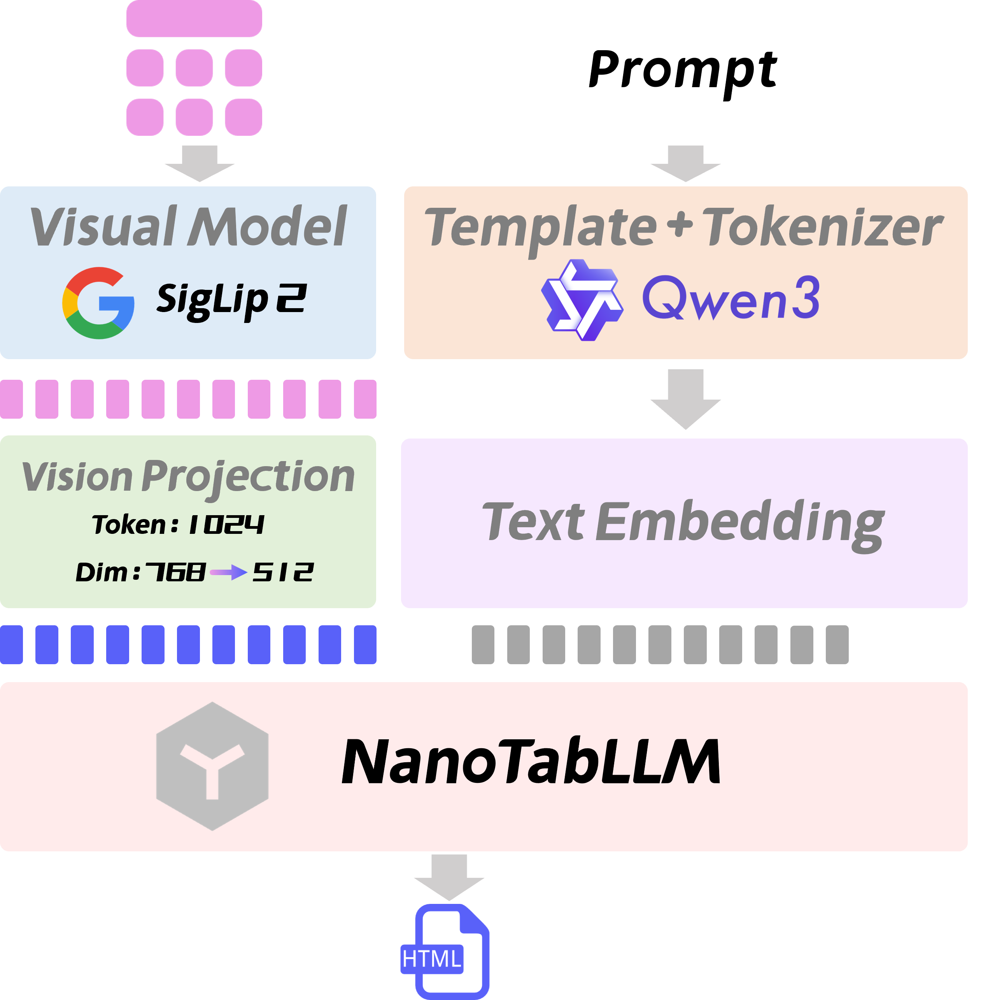
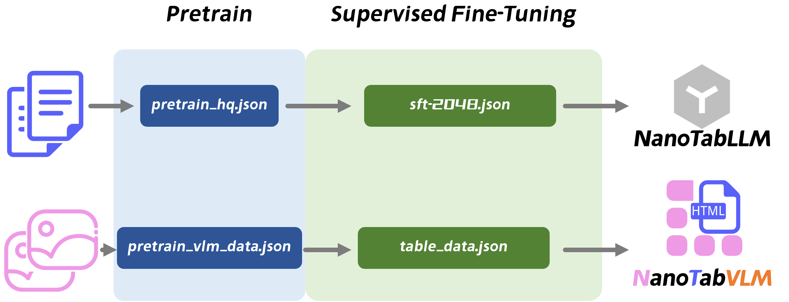

<div align="center">
  
</div>

# NanoTabVLM：小模型，大作为


中文 | [English](./README-en.md)


## 项目介绍
NanoTabVLM 是一款轻量级多模态模型，参数量仅 0.5B，却拥有强大的表格处理能力。它专注于将图片中的表格精准转换为 HTML 格式文本，在转换精度上表现卓越，平均编辑距离（Edit Distance）不足 8B 模型的 1/7，更是仅为同级别参数量 VLM 模型的 1/10，且能灵活应对跨行、跨列、包含空格等各类复杂表格样式。在多模态/视觉多模态理解领域，它高效发挥作用，为表格的数字化转换提供了便捷且精准的解决方案。

通过与其他几款模型的对比实验，充分展现了 NanoTabVLM 的出色性能。具体结果如下表所示：

| 模型                   | Size | all    | zh       | en     | span   | blank  |
|----------------------|------|--------|----------|--------|--------|--------|
| GLM-4.1V-9B-Thinking | 9B   | 0.1537 | 0.1663   | 0.1411 | 0.1790 | 0.1175 |
| InternVL3.5-8B       | 8B   | 0.1365 | 0.1454   | 0.1274 | 0.1580 | 0.1036 |
| InternVL3.5-4B       | 4B   | 0.1678 | 0.1737   | 0.1619 | 0.1886 | 0.1347 |
| InternVL3.5-2B       | 2B   | 0.1678 | 0.1663   | 0.1693 | 0.1906 | 0.1305 |
| InternVL3.5-1B       | 1B   | 0.2021 | 0.2021   | 0.2020 | 0.2293 | 0.1581 |
| MiniCPM-V 4.5        | 8B   | 0.1576 | 0.1639   | 0.1513 | 0.1844 | 0.1177 |
| NanoTabVLM           | 0.5B | 0.0221 | 0.0225   | 0.0196 | 0.0233 | 0.0161 |

**指标解释**：
- `all`：代表所有表格图像数据。
- `zh`：代表中文表格。
- `en`：代表英文表格。
- `span`：代表有跨行跨列的表格。
- `blank`：代表存在空单元格的表格。

<div align="center">
  <video controls width="80%" loop>
    <source src="images/assets/demo.mp4" type="video/mp4">
  </video>
</div>

## 项目特点
- **小参数量，高性能**：仅 0.5B 参数量，在图片表格转 HTML 任务上的表现却优于 8B 规模的 VLM 模型，平均编辑距离 Edit Distance 不足 8B 模型的 1 / 7，同级别参数量 VLM 模型的 1 / 10。
- **功能专一精准**：专门用于图片表格到 HTML 格式的转换，转换结果准确率极高。
- **结构简洁清晰**：模型结构简单，便于理解、部署与二次开发。
- **完整训练流程**：历经数据构建、预训练（Pretrain）、有监督微调（SFT）等环节，且通过对比实验验证了模型效果。

## 快速开始

1. **克隆代码**：
   ```bash
   git clone https://github.com/FutureUniant/NanoTabVLM.git
   cd NanoTabVLM
   ```
   
2. **下载 SigLip2 模型**：  
   可通过项目指定的模型下载链接或相关模型仓库获取 SigLip2 模型文件，并放置到`model/vision_model`目录下
   ```text
    git clone https://huggingface.co/google/siglip2-base-patch16-512
    ```
    或
    ```text
    git clone https://modelscope.cn/models/google/siglip2-base-patch16-512
    ```
   
3. **下载权重模型**：  
   从[FuturEAnt/NanoTabVLM](https://modelscope.cn/models/FuturEAnt/NanoTabVLM)下载权重，获取 NanoTabVLM 训练好的权重文件，放到`checkpoint`目录。

4. **准备环境**：
   - 创建虚拟环境（可选但推荐）：  
     `conda create -n nanotabvlm python=3.10`  
     `conda activate nanotabvlm`
   - 安装依赖：  
     `pip install -r requirements.txt`

5. **启动测试 或 WebUI**：
   - 测试：运行测试脚本  
     `python eval_tabvlm.py`
   - WebUI：启动 Web 界面服务  
     `python app.py`（默认为 `http://127.0.0.1:8001`）


## NanoTabVLM 细节
### 模型结构
NanoTabVLM（视觉语言模型，VLM）的基座语言模型为 NanoTabLLM，该语言模型经过精心设计与训练，具备良好的文本理解和生成能力。视觉部分采用 SigLip2，SigLip2 在视觉特征提取与多模态语义对齐方面表现出色，能有效捕捉图片中表格的视觉信息。分词器（tokenizer）使用的是 Qwen3 的 tokenizer，借助 Qwen3 成熟的分词能力，可对文本进行精准分词，助力模型更好地处理文本内容。
<div align="center">
  
</div>


### 训练数据集
- **LLM 部分**：
  - 预训练（Pretrain）：使用 `modelscope` 上 `gongjy/minimind_dataset` 中的 `pretrain_hq.jsonl`（大小为 1.6GB），该数据集包含丰富的文本数据，为语言模型预训练提供了充足的语料。
  - 有监督微调（SFT）：采用 `modelscope` 上 `gongjy/minimind_dataset` 中的 `sft_2048.jsonl`，通过有监督的微调，让语言模型能更好地适应特定任务。
- **VLM 部分**：
  - 预训练（Pretrain）：使用 `modelscope` 上 `gongjy/minimind-v_dataset` 中的 `pretrain_vlm_data.jsonl`，此数据集包含大量图片 - 文本对，用于多模态模型的预训练，以学习视觉与语言的关联。
  - 有监督微调（SFT）：使用自定义的表格图像数据，这些数据是专门针对图片表格转 HTML 任务构建的，包含各种复杂样式的表格图片及其对应的 HTML 格式文本。

### 训练流程
训练过程分为两个主要阶段。首先是语言模型 NanoTabLLM 的训练，先进行预训练，让模型在大规模无监督文本数据上学习通用的语言表示能力；之后进行有监督微调，基于特定任务的标注数据，进一步提升模型在目标任务上的性能。完成 NanoTabLLM 的训练后，开展多模态模型 NanoTabVLM 的训练，同样先进行预训练，使视觉和语言部分能初步建立关联，学习多模态表示；接着进行有监督微调，利用自定义的表格图像数据，让模型精准掌握图片表格转 HTML 的任务技能。
<div align="center">
  
</div>


## 鸣谢
如果您觉得 NanoTabVLM 对您有帮助，请给我们点个星 ⭐️ 支持一下！

## 参考链接与致谢
- [MiniMind](https://github.com/jingyaogong/minimind)
- [MiniMind-V](https://github.com/jingyaogong/minimind-v)
- [SigLIP 2](https://arxiv.org/abs/2502.14786)
```bibtex
@misc{tschannen2025siglip2multilingualvisionlanguage,
      title={SigLIP 2: Multilingual Vision-Language Encoders with Improved Semantic Understanding, Localization, and Dense Features}, 
      author={Michael Tschannen and Alexey Gritsenko and Xiao Wang and Muhammad Ferjad Naeem and Ibrahim Alabdulmohsin and Nikhil Parthasarathy and Talfan Evans and Lucas Beyer and Ye Xia and Basil Mustafa and Olivier Hénaff and Jeremiah Harmsen and Andreas Steiner and Xiaohua Zhai},
      year={2025},
      eprint={2502.14786},
      archivePrefix={arXiv},
      primaryClass={cs.CV},
      url={https://arxiv.org/abs/2502.14786}, 
}
```